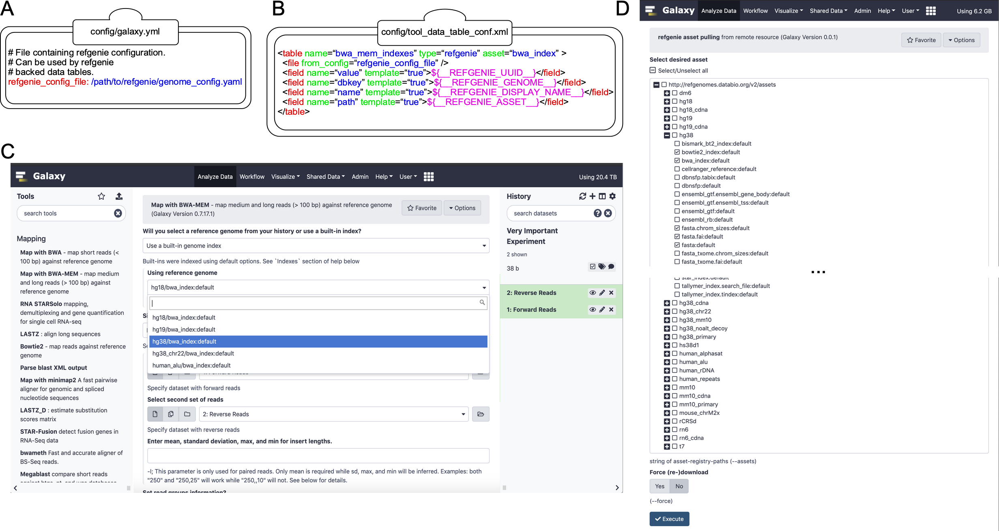

## refgenie for Local Instances, with Local Refgenie

Built-in data files are critical for many Galaxy tools. This page will describe how to use **[refgenie](http://refgenie.databio.org/)** with your local instance of Galaxy.

Please note that "built-in" or "cached" data can also be managed natively from within the Galaxy admin interface. For details, see: **[Data Managers Overview](/admin/tools/data-managers/)** and our **[Data Managers Tutorial](https://github.com/galaxyproject/dagobah-training/blob/2017-montpellier/sessions/05-reference-genomes/ex1-reference-genomes.md)**.

## How it works

There are several steps needed for using refgenie with Galaxy. The first is to initialize a refgenie installation locally, following the standard directions at the **[refgenie](http://refgenie.databio.org/)** website. Next, the galaxy.yml file needs to modified to point to the location of the `genomes.yml` file. Finally, an optional Data Manager tool can be installed from the ToolShed to enable a Galaxy administrator to populate the configured refgenie installation through the Galaxy interface.

### Inititalize refgenie

Install refgenie and run `refgenie init`, e.g.:

```shell
/$ mkdir refgenie
/$ cd refgenie
/refgenie$ virtualenv -p python3 venv
  ...
/refgenie$ source venv/bin/activate
(venv) /refgenie$ pip install refgenie
  ...
(venv) /refgenie$ refgenie init -c genome_config.yaml
Initialized genome configuration file: /refgenie/genome_config.yaml
```

List available remote genomes:

```shell
(venv) /refgenie$ refgenie listr -c genome_config.yaml
  ...
```

Install a genome:

```shell
(venv) /refgenie$ refgenie pull -c genome_config.yaml -g t7 fasta
  ...
```

### Configure Galaxy to load refgenie genomes

Edit `/$GALAXY_ROOT/config/galaxy.yml` to point to the refgenie genome configuration YAML file:

```yml
  # File containing refgenie configuration, e.g.
  # /path/to/genome_config.yaml. Can be used by refgenie backed tool
  # data tables.
  refgenie_config_file: /refgenie/genome_config.yaml
```

and then restart the Galaxy server.


### Install a Data Manager tool for refgenie (optional)

For information on installing tools from the ToolShed, follow these [directions](/admin/tools/add-tool-from-toolshed-tutorial/). Search for "refgenie", to find the relevant tool.

To access and run Data Manager tools, follow these [directions](/admin/tools/data-managers/).

To allow Data Tables to be refreshed using the API, you must properly configure `galaxy_infrastructure_url` in the `/$GALAXY_ROOT/config/galaxy.yml` configuration file and then restart the Galaxy server. This URL must be accessible from the location where the job is executed. 

## Figure 1. Extending Galaxy’s reference data with refgenie.


**Figure 1. Extending Galaxy’s reference data with refgenie.** (A) Setting the value of ‘refgenie_config_file’ to the previously chosen genome configuration file path within the primary Galaxy configuration file (e.g. ‘galaxy.yml’). (B) Example data table mapping between refgenie assets and Galaxy data tables for the BWA tool. Cheetah templating language is used to specify mappings between values, with several pre-populated refgenie variables available as shown. (C) refgenie assets are available for users to select and use in the Galaxy BWA tool. In this example, the user is mapping a set of paired-end sequencing reads against the hg38 genome. (D) A dynamically generated list of available remote refgenie assets are listed for an administrator to select in the ‘refgenie pull’ Galaxy Data Manager tool.

## refgenie for Local Instances, with CVMFS Refgenie

First, follow directions on installing and configuring CVMFS available [here](../reference-data-repo/#mounting-reference-data-with-cernvm-fs-cvmfs).

### Configure Galaxy to load refgenie genomes

Edit `/$GALAXY_ROOT/config/galaxy.yml` to point to the CVMFS-based refgenie genome configuration YAML file:

```yml
  # File containing refgenie configuration, e.g.
  # /path/to/genome_config.yaml. Can be used by refgenie backed tool
  # data tables.
  refgenie_config_file: /cvmfs/refgenomes-databio.galaxyproject.org/genomes_config.yaml
```

and then restart the Galaxy server.

This configuration will allow use of CVMFS-based refgenie assets, but not the refgenie Data Manager tool. To enable both, please see the following [section](#local-refgenie-instance-and-cvmfs-based-regenie).


## Local refgenie instance and CVMFS-based regenie

First, follow the directions above for configuring a [local refgenie server in Galaxy](#refgenie-for-local-instances). The global refgenie_config_file will be configured to point to your local refgenie installation. This is required for proper usage of the Data Manager tool.

Next, follow directions on installing and configuring CVMFS available [here](../reference-data-repo/#mounting-reference-data-with-cernvm-fs-cvmfs).

### Configure Galaxy to load refgenie genomes from CVMFS

Edit `/$GALAXY_ROOT/config/tool_data_tables_conf.xml` and add entries that point to refgenie on CVMFS:

```xml
    <!-- Refgenie __dbkeys__ -->
    <table name="__dbkeys__" type="refgenie" asset="fasta" >
        <file path="/cvmfs/refgenomes-databio.galaxyproject.org/genomes_config.yaml" />
        <field name="value" template="true">${__REFGENIE_GENOME__}</field>
        <field name="name" template="true">${__REFGENIE_DISPLAY_NAME__}</field>
        <field name="len_path" template="true">${__REFGENIE_SEEK_KEY__('chrom_sizes')}</field>
    </table>
    <!-- Refgenie all_fasta -->
    <table name="all_fasta" type="refgenie" asset="fasta" >
        <file path="/cvmfs/refgenomes-databio.galaxyproject.org/genomes_config.yaml" />
        <field name="value" template="true">${__REFGENIE_UUID__}</field>
        <field name="dbkey" template="true">${__REFGENIE_GENOME__}</field>
        <field name="name" template="true">${__REFGENIE_DISPLAY_NAME__}</field>
        <field name="path" template="true">${__REFGENIE_ASSET__}</field>
    </table>
    <!-- Refgenie fasta_indexes (samtools) -->
    <table name="fasta_indexes" type="refgenie" asset="fasta" >
        <file path="/cvmfs/refgenomes-databio.galaxyproject.org/genomes_config.yaml" />
        <field name="value" template="true">${__REFGENIE_UUID__}</field>
        <field name="dbkey" template="true">${__REFGENIE_GENOME__}</field>
        <field name="name" template="true">${__REFGENIE_DISPLAY_NAME__}</field>
        <field name="path" template="true">${__REFGENIE_ASSET__}</field>
    </table>
    <!-- Refgenie bowtie2_indexes -->
    <table name="bowtie2_indexes" type="refgenie" asset="bowtie2_index" >
        <file path="/cvmfs/refgenomes-databio.galaxyproject.org/genomes_config.yaml" />
        <field name="value" template="true">${__REFGENIE_UUID__}</field>
        <field name="dbkey" template="true">${__REFGENIE_GENOME__}</field>
        <field name="name" template="true">${__REFGENIE_DISPLAY_NAME__}</field>
        <field name="path" template="true">${__REFGENIE_ASSET__}</field>
    </table>
    <!-- Refgenie bwa_indexes -->
    <table name="bwa_mem_indexes" type="refgenie" asset="bwa_index" >
        <file path="/cvmfs/refgenomes-databio.galaxyproject.org/genomes_config.yaml" />
        <field name="value" template="true">${__REFGENIE_UUID__}</field>
        <field name="dbkey" template="true">${__REFGENIE_GENOME__}</field>
        <field name="name" template="true">${__REFGENIE_DISPLAY_NAME__}</field>
        <field name="path" template="true">${__REFGENIE_ASSET__}</field>
    </table>
    <!-- Refgenie hisat2_indexes -->
    <table name="hisat2_indexes" type="refgenie" asset="hisat2_index" >
        <file path="/cvmfs/refgenomes-databio.galaxyproject.org/genomes_config.yaml" />
        <field name="value" template="true">${__REFGENIE_UUID__}</field>
        <field name="dbkey" template="true">${__REFGENIE_GENOME__}</field>
        <field name="name" template="true">${__REFGENIE_DISPLAY_NAME__}</field>
        <field name="path" template="true">${__REFGENIE_ASSET__}</field>
    </table>
```

and then restart the Galaxy server. These entries are in addition to the existing refgenie entries, which refer to the globally declared refgenie configuration.
