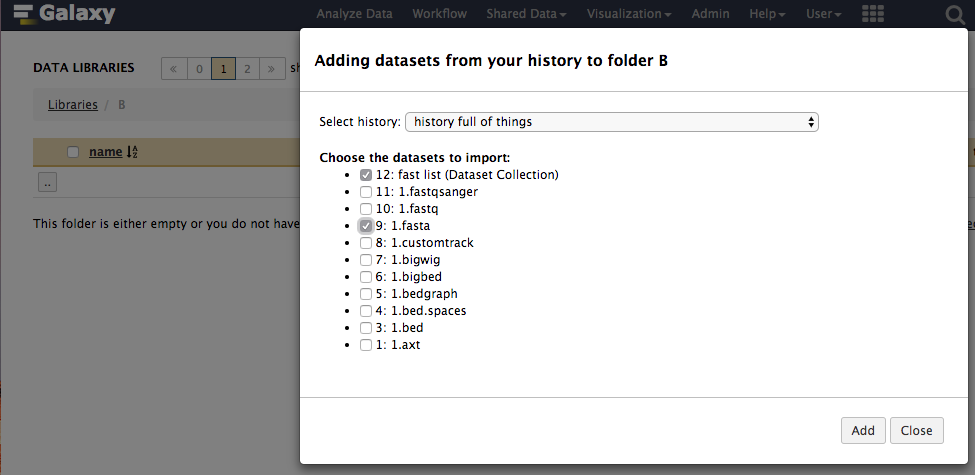
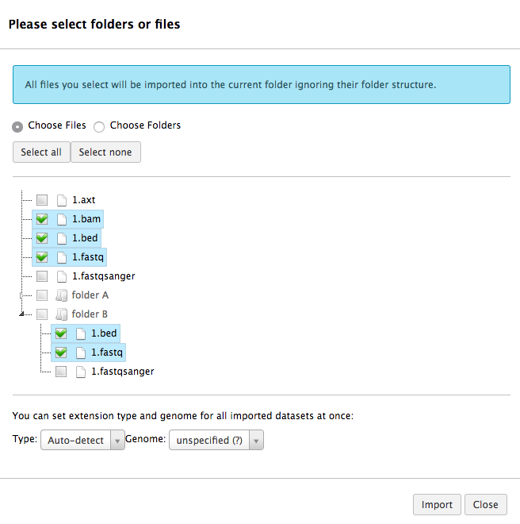
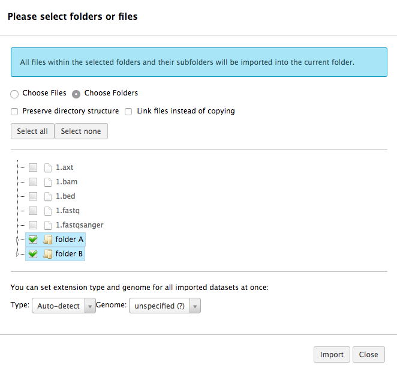

Galaxy data libraries provide a way to conveniently share Galaxy datasets within a group of Galaxy users or with everybody that has access to a specific instance of Galaxy. The biggest advantages of the data libraries are:

* You can import data from filesystem into the library without copying it.
* You can import whole directories preserving the folder structure within.
* The dataset's size does not count towards your usage [quota](/admin/disk-quotas/).

# Interface

You can explore the annotated interface:

* [list of libraries](/data-libraries/screen/list-of-libraries/)
* [folder contents](/data-libraries/screen/folder-contents/)

# Importing datasets

Given you have the permissions you can create folders and import datasets into a library.

## from history

Select the `Add datasets/from History` at the folder toolbar.


Choose history and select datasets you want to import into current folder. Hit `Add`.


<div class="alert alert-info" role="alert">
You can select dataset collections in this interface. It will flatten its contents and import it as individual datasets.
</div>

## from user folder

This option is available only if admin of the Galaxy instance configured it.

Select the `Add datasets/from User Directory` at the folder toolbar.  


Select files you want to import. You can set `Type` and `Genome` if applicable.  


Select folders to be imported. You can choose whether to `preserve directory structure` (otherwise it fill be flattened) and if you want to `link instead of copying`. Talk to your administrator whether to use linking to files instead of copying - it depends on your file preservation policy.  


<div class="alert alert-warning trim-p" role="alert">

For Galaxy [Main](/main/) linking is discouraged since FTP folders are periodically cleaned up.

</div>

# Administration

Every library has to be created (and deleted) by an [admin](/admin/) user but subsequently can be filled with datasets and folders by anyone with permissions. It has multiple levels of access control for the data inside ranqing from 'public' to 'one person only'.

<div class="alert alert-info" role="alert">
You save space on the Galaxy instance as every dataset in the library is stored only once no matter how many users are using it in their histories.
</div>

## Import configuration

### User folder

As an admin you can allow users to import datasets to libraries from a configured folder. This is enabled by setting
`user_library_import_dir` in the `config/galaxy.yml` to a path accessible by the user that runs the Galaxy process.
Galaxy expects the folder to contain subfolders named after email addresses of your instance's users. Each user will only see the contents of their folder. A common setup is that the value for `user_library_import_dir` is the same as for `ftp_upload_dir` allowing users to [upload files via FTP](/ftp-upload/) and then import them either in history or data library. This assumes you have an FTP server [running and configured](/admin/config/upload-via-ftp/) to work with Galaxy.

Example structure with `user_library_import_dir = ftp_upload`.

```
ftp_upload/
└── marten@bx.psu.edu
    ├── 1.axt
    ├── 1.bam
    ├── 1.bed
    ├── 1.bed.spaces
    └── 1.fastqsanger
```

### Path paste

By setting `allow_path_paste = True` in the `config/galaxy.yml` you enable administrators to import from any path entered (beginning with `file://`) in the "Paste/Fetch data" menu of the Galaxy Upload Manager. This feature is not available to non-admin users.

## Permissions

When a data library is first created, it is considered "public" and it will be displayed in the "Data Libraries" view for any user, even anonymous. The Galaxy administrator can restrict access to a data library by associating roles with the data library's `access library` permission. This permission will conservatively override the (dataset) "access" permission for the data library's contained datasets.

For example, if a data library's "access library" permission is associated with Role1 and the data library contains public datasets, the data library will still only be displayed to those users that have Role1. However, if the data library's "access library" permission is associated with both Role1 and Role2 and the data library contains datasets whose [dataset] "access" permission is associated with only Role1, then users that have Role2 will be able to access the library, but will not see those contained datasets whose [dataset] "access" permission is associated with only Role1.

In addition to the "access library" permission, permission to perform the following functions on the data library (and its contents) can be granted to users (a library item is one of: a data library, a library folder, a library dataset).

* add library item - Users that have the role can add library items to this data library or folder
* modify library item - Users that have the role can modify this library item
* manage library permissions - Users that have the role can manage permissions applied to this library item

The default behavior is for no permissions to be applied to a data library item, but applied permissions are inherited
downward (with the exception of the "access library" permission, which is only available on the data library itself).
Because of this, it is important to set desired permissions on a new data library when it is created.  When this is done,
new folders and datasets added to the data library will automatically inherit those permissions.

## Additional resources

The Galaxy Adminstration Docs have even more configuration help plus admin scripts to help manage data libraries.

* Configuration details (release specific): Search with the configuration option tag for more details here https://docs.galaxyproject.org
* Scripts & Tricks: [Uploading a directory into a Data Library](https://docs.galaxyproject.org/en/latest/admin/useful_scripts.html#uploading-a-directory-into-a-data-library)

