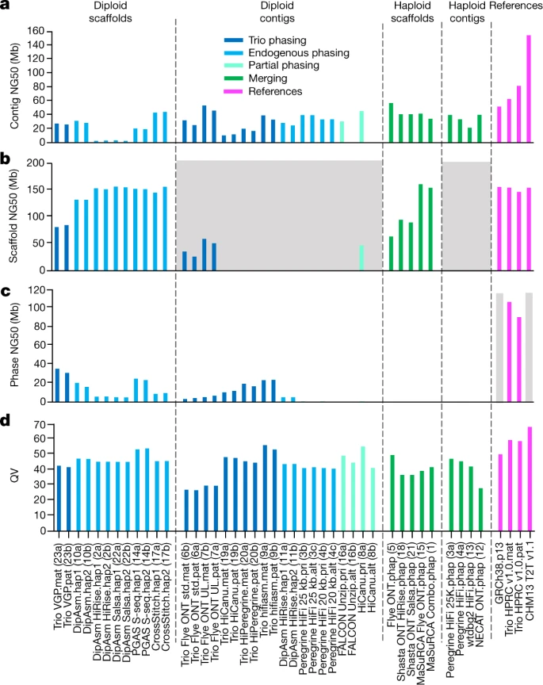

Jarvis and colleagies have used [Galaxy](https://galaxyproject.org) for all major components of their assembly pipeline. Please read their Nature [paper](https://www.nature.com/articles/s41586-022-05325-5) to learn more and check out our [Galaxy assembly page](https://galaxyproject.org/projects/vgp/).

**Congratulations** to this great publication and thanks for using the **European Galaxy server** and sharing your results with us!

**Abstract:**

The current human reference genome, GRCh38, represents over 20 years of effort to generate a high-quality assembly, which has benefitted society. However, it still has many gaps and errors, and does not represent a biological genome as it is a blend of multiple individuals. Recently, a high-quality telomere-to-telomere reference, CHM13, was generated with the latest long-read technologies, but it was derived from a hydatidiform mole cell line with a nearly homozygous genome. To address these limitations, the Human Pangenome Reference Consortium formed with the goal of creating high-quality, cost-effective, diploid genome assemblies for a pangenome reference that represents human genetic diversity. Here, in our first scientific report, we determined which combination of current genome sequencing and assembly approaches yield the most complete and accurate diploid genome assembly with minimal manual curation. Approaches that used highly accurate long reads and parent–child data with graph-based haplotype phasing during assembly outperformed those that did not. Developing a combination of the top-performing methods, we generated our first high-quality diploid reference assembly, containing only approximately four gaps per chromosome on average, with most chromosomes within ±1% of the length of CHM13. Nearly 48% of protein-coding genes have non-synonymous amino acid changes between haplotypes, and centromeric regions showed the highest diversity. Our findings serve as a foundation for assembling near-complete diploid human genomes at scale for a pangenome reference to capture global genetic variation from single nucleotides to structural rearrangements.

