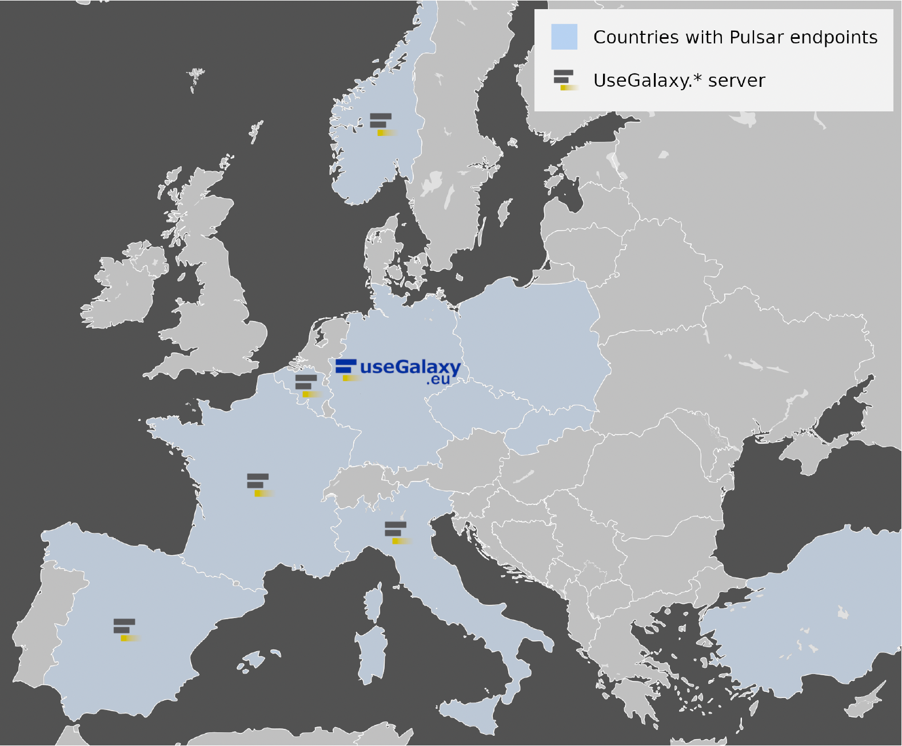

# Building a distributed compute network across Europe

The [**EuroScienceGateway**](/projects/esg/) Work Package 3 _Pulsar Network: Distributed heterogeneous compute_, led by the Italian National Research Council, aims to deploy an European wide network of Pulsar endpoints, enabling end-users to easily access and exploit remote compute resources, and resource providers to offer compute resources for scientific purposes through a web-based interface.

Pulsar is a lightweight Python application that can be used for  offloading Galaxy jobs on a remote cluster. Pulsar can automatically import the input data required to run the job and export  the results back to the originating Galaxy instance. Several Pulsar nodes hosted in data centers across Europe constitute the Pulsar Network (https://pulsar-network.readthedocs.io), a distributed job execution system, allowing to scale the computing resources available to Galaxy instances over heterogeneous compute facilities.

WP3 will advance the Pulsar Network to the production level, hardening the existing network and, further extending it, leveraging the computing resources of 13 European countries, and making it accessible through 6 national Galaxy usegalaxy.``*``.

<figcaption>
  Minimal coverage of Pulsar endpoints and Galaxy National instances expected at the end of the project.
</figcaption>

To further easily extend the Network, WP3 is developing an Open Infrastructure, providing to resource providers the instruments to easily deploy and manage Pulsar endpoints and Galaxy instances, tackling the increasing demand of computing capacity, and opening up the Pulsar service to additional scientific domains.

Finally, by integrating the [GA4GH TES](https://www.ga4gh.org/news/ga4gh-tes-api-bringing-compatibility-to-task-execution-across-hpc-systems-the-cloud-and-beyond/) APIs in Pulsar, the service will be opened to other workflow systems, thus enabling other services beyond Galaxy to submit jobs to the Pulsar Network. As a proof of concept, the [Workflow Execution Service](https://github.com/inab/WfExS-backend) will be extended to support TES APIs, therefore allowing the underlying engines, e.g. Nextflow or CWL, to execute tasks using the Pulsar Network.

#### WP3 Resources
* [WP3 introduction slides at European Galaxy Days 2022](wp3_kickoff_slides.pdf) 

#### WP3 Objectives
* O3.1 Build a European wide job-scheduling network
* O3.2 Make Pulsar endpoints conform the GA4GH Task Execution Service standard
* O3.3 Deploying TRL-9 web services to access the Pulsar Network

#### WP3 Tasks
* Task 3.1 Develop and maintain an Open Infrastructure based deployment model for Pulsar endpoints
* Task 3.2 Add GA4GH Task-Execution-Service (TES) API to Pulsar
* Task 3.3 Build a European-wide network of Pulsar sites
* Task 3.4 Add TES support to WfExS (Workflow Execution Service)
* Task 3.5 Developing and maintaining national or domain-driven Galaxy servers
