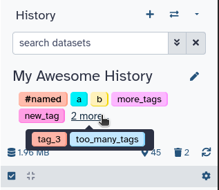
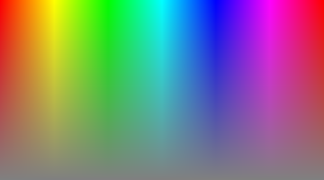
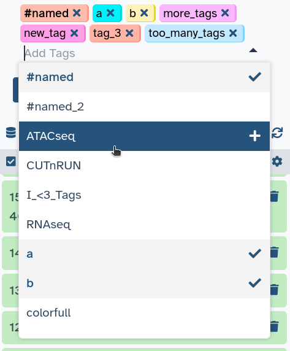
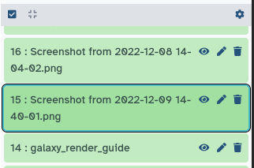
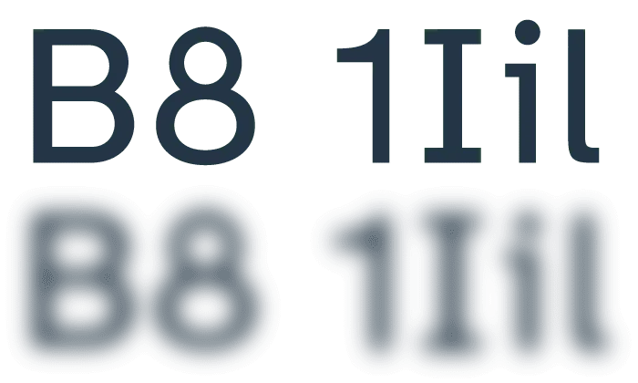

Hello, I'm Laila a front-end developer for Galaxy from the Freiburg team, and part of the UI/UX working-group. For the upcoming 23.0 update improving Galaxy's accessibility was a high priority for the UI/UX team. This is a preview of some of the accessibility related changes I am most excited about.
We would like to bring more attention to accessibility in general, and hope to show how increased focus on accessibility benefits everyone's user experience.

This is just a selection of some highlights.
The accessibility has improved in many regions throughout Galaxy, and there is more in the works for future releases.
We still have some work to do until Galaxy is as accessible as we want it to be, so please continue reporting any accessibility concerns you run into.

## Tags

The current tagging component has a few accessibility issues, which can not be solved by us without changing the underlying library.
For this reason a new tag component was built from scratch.
It's making it's debut in the History, but will be gradually rolled out across all Galaxy components.
Changes to replace the old tag component are already in the works for Workflows and the Datasets List.

*The new tag component*

### Color

Like the old tagging component, the tags color is determined randomly based on the tags name, so matching tags can easily be spotted.
Previously HSL was used for this, by choosing a random Hue, and a random lightness within a range.

HSL however has an issue: The lightness is not consistent across the hue spectrum. This means some colors appeared lighter than intended, others darker, making some tags hard to read.

|  |  |
|---|---|
| HSL Color spectrum, mapping hue to saturation with fixed lightness | The same image showing just the perceived lightness value |
*image sources: [HSLuv Comparison Page](https://www.hsluv.org/comparison/)*

For this reason we switched to a new color space: HSLuv.
This color space offers a uniform brightness across the hue/saturation spectrum, making the brightness of generated colors more predictable.
This also allows us to make more precise adjustments to the color generation in the future.

[Read more about HSLuv](https://www.hsluv.org/)

### Contrast

The tags outline is back! Tags can be hard to tell apart from the background, when they have a uniform color.
For this reason the new tag component reintroduces a subtle outline.
The outline does not fully surround the tag, to give it a more modern appearance, while still offering the benefits of improved contrast.

### Autocomplete

The new Tags have an autocompletion menu.
This menu can be easily navigated by keyboard or mouse, to add or remove tags.
It is also the primary way of deleting tags via keyboard.
Just search for a previously added tag and press enter to delete it.

The auto-completion contains every tag in use on your Galaxy account.

## Keyboard Navigation in the History

Not just the tag component in the history got some keyboard upgrades, but also the history itself.
Every button on the history items is now keyboard focusable, and the items can be expanded via keyboard.

The keyboard focus also only steps into a history item if it is expanded, making it much faster to select the right item from the history. 

## Heading Hierarchy, Aria Labels and Screen-Reader Texts

A lot of mark up improvements have been made for screen readers.

All heading elements have been reordered to follow semantic hierarchy, and the headings sizes are now determined by helper classes, instead of the heading level.
This is important for screen readers, and other software, so they can generate a table of content. Read more about heading levels on [W3C](https://www.w3.org/WAI/tutorials/page-structure/headings/) or [MDN](https://developer.mozilla.org/en-US/docs/Web/HTML/Element/Heading_Elements#usage_notes).

An effort was made to make all elements keyboard selectable, and aria labels were added to many elements. This is important to communicate their use to screen readers, if it is not obvious from the tag itself. Region aria labels were also introduced, to help differentiate sections of the page from one another. E.g the main content from the side-bars. Read more about labeled regions on [W3C](https://www.w3.org/WAI/tutorials/page-structure/labels/).

Screen-reader only texts have also been added, to help in places where previously only icons communicated an action.

## New font

*image source: [Braille Institute](https://brailleinstitute.org/freefont)*

A small, yet noticeable and change. Galaxy used to rely on a stack of system fonts to display and text. This marginally improves loading times when first visiting Galaxy, but has several down-sides:

- Not all system fonts are easy to read. The distinction between similar characters like "I" "l" and "1" can be especially challenging. This is amplified by any visual or other reading impairment
- Text looks different on different devices, making it harder to find places with problematic spacing, or bad readability

To solve both of these problems we switched to an app-wide standard font: "Atkinson Hyperlegible"

It's a free to use font, designed to maximize readability, while maintaining a professional and clean look.

Here's a comparison between the old font on Ubuntu, vs the new unified Font.

[Read more about Atkinson Hyperlegible on the Braille Institutes page about the font.](https://brailleinstitute.org/freefont)

## Future Plans

A priority goal for us is to make Galaxy fully usable by keyboard.
Another aspect will be to add even more accessibility-specific testing, to ensure there are no regressions.

## Accessibility is for everyone.

Accessibility for applications is a wide topic, with many different aspects. Some specific to certain needs, others broad.
Thinking about how we design our app in a more accessible manner, leads to new perspectives on user experience, prioritizing ease of use and focusing on more diverse input methods beyond those we are used to ourselves.

We want to highlight that these changes benefit every user to some degree, making them well worth the effort, and implore you to consider prioritizing accessibility in other projects as well; be it by developing with accessibility in mind, or speaking out for changes favoring accessibility.

A big thank you goes out to everyone how contributed on improving galaxies accessability.
This includes everyone who has reported accessability issues.
Your detailed reports have helped a lot in this effort!

Thank you for reading.
