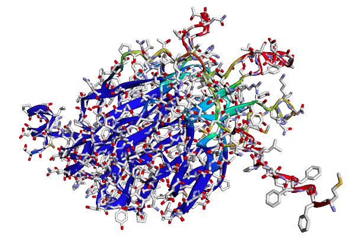

## Introduction

Artificial intelligence (AI) algorithms are being increasingly applied in several fields of Bioinformatics such as protein 3D structure
and drug-response prediction, imputing missing data in single-cell gene expression, image segmentation using biomedical images
and many more. AI algorithms that train on a large amount of scientific data require powerful compute infrastructure consisting of
several CPUs, GPUs and a large storage. [JupyterLab](https://jupyterlab.readthedocs.io/en/stable/) provides an excellent framework
for developing AI programs but it needs to be hosted on such a powerful infrastructure. To bridge this gap an open-source, Docker-based,
and GPU-enabled JupyterLab notebook infrastructure has been developed that runs on the public compute infrastructure of Galaxy for
rapid prototyping and developing end-to-end AI projects. Using such an infrastructure, long-running AI model training programs
can be executed remotely. Trained models, represented in a standard [open neural network exchange](https://github.com/onnx/onnx) (ONNX)
format and other resulting datasets are created in a Galaxy history. Other features include GPU support for faster training, support
for machine learning packages such as [TensorFlow](https://www.tensorflow.org/) and [Scikit-learn](https://scikit-learn.org/stable/),
Git integration for version control, the option of creating and executing pipelines of notebooks, the availability of multiple
dashboards for monitoring compute resources and visualizations using [Bokeh](https://docs.bokeh.org/en/latest/),
[Seaborn](https://seaborn.pydata.org/), [Matplotlib](https://matplotlib.org/), [Bqplots](https://github.com/bqplot/bqplot),
[Voila](https://github.com/voila-dashboards/voila). In addition, the JupyterLab tool can also be used as a
regular Galaxy tool in a [workflow](https://usegalaxy.eu/u/kumara/w/gpujupytool-imported-from-uploaded-file).
These features make the JupyterLab notebook highly suitable for creating and managing AI projects.

## Implementation

A Docker container is created that installs several packages such as JupyterLab, TensorFlow, Scikit-learn, Pandas,
Bokeh, Elyra AI, Seaborn, ONNX, Git, GPU dashboard, ColabFold, JAX and many others for machine learning and data science projects.
The container inherits an official ["NVIDIA/CUDA" base container](https://hub.docker.com/layers/nvidia/cuda/11.8.0-cudnn8-runtime-ubuntu20.04/images/sha256-74b166e2091bb705e9ada685dffe79930612c725669bc87e01125b5245d13f97?context=explore) that contains CUDA packages for GPUs
to work with TensorFlow and then installs the above-mentioned packages. The Docker container is downloaded by a [Galaxy interactive tool](https://github.com/galaxyproject/galaxy/blob/release_23.0/tools/interactive/interactivetool_ml_jupyter_notebook.xml)
to make it available on Galaxy. Having a Docker container running in the backend provides many security benefits as it interacts
minimally with the remote computer's operating system. In addition, a non-root user inside the container provides additional security benefits.
These benefits are important as users can execute arbitrary code on JupyterLab notebooks. The Docker container can separately
be downloaded to any laptop or personal computer (having at least 20 GBs of space) or any other compute infrastructure from
[Docker hub](https://hub.docker.com/layers/anupkumar/docker-ml-jupyterlab/galaxy-integration-0.2/images/sha256-e2d7e28a2f975523db0f5ac29c2e2ce3c7a35b061072098ad388d5b42ee86fba?context=repo) and used.
If NVIDIA GPUs are available, the Docker container will automatically recognise them. Otherwise, it will run on CPUs.
The scripts to run the container is mentioned in the [GitHub repository](https://github.com/usegalaxy-eu/gpu-jupyterlab-docker). In JupyterLab notebooks, additional packages to create different scientific analyses can be installed and development environments such as using `conda` or `mamba` can be created.

## Use-cases

A recent scientific publication that predicts infected regions of [COVID-19 CT scan images](https://www.sciencedirect.com/science/article/pii/S2666990021000069) is reproduced using multiple features of JupyterLab.
In addition, [ColabFold](https://github.com/sokrypton/ColabFold), a faster implementation of
[AlphaFold2](https://www.nature.com/articles/s41586-021-03819-2), can also be accessed in this notebook to predict
the 3D structure of protein sequences. JupyterLab notebook is accessible in two ways - first as an interactive Galaxy
tool and second by running the underlying docker container. In both ways, long-running training can be executed on
Galaxy’s compute infrastructure. The figure below shows the predicted infected regions of COVID-CT scan images by
training Unet AI model on the JupyterLab infrastructure. The accuracy is similar to as published in the
associated [paper](https://www.sciencedirect.com/science/article/pii/S2666990021000069). 

### Use-case 1: Image segmentation of COVID-19 CT scans

The figure below shows the predicted infected regions of COVID-CT scan images by training Unet AI model on the JupyterLab infrastructure. The accuracy is similar to as published in the associated [paper](https://www.sciencedirect.com/science/article/pii/S2666990021000069).

### Use-case 2: Prediction of 3D structures of proteins

The figure above shows predicted 3D structure of spike protein of SARS-CoV-2 using ColabFold.

## GPU JupyterLab as a Galaxy tool in a workflow

GPU JupyterLab intergation in Galaxy can be used as normal Galaxy tool. It takes input datasets from other Galaxy tools, process them in an
IPython notebook and produce output datasets. Those feature makes Jupyterlab perfectly able to be run inside Galaxy workflows.
The following figure shows a sample workflow where GPU JupyterLab tool is used in a Galaxy workflow.

## How to apply for this resource

Please follow these steps for application:

1. Create an account on [Galaxy Europe](https://usegalaxy.eu/) using your official university/company email id.
  `*` If you already have an account change make sure to use an official university/company email in your user preferences.
2. [Apply for accessing GPU JupyterLab](http://usegalaxy.eu/gpu-request).
3. Use your official university/company email id in the Google form that matches your Galaxy account.
4. Once your request is approved, you will be able to run the GPU-enabled JupyterLab notebook on Galaxy.
5. If your are not authorised, you will get an error message that will guide you to the request [form](http://usegalaxy.eu/gpu-request).
6. [Contact us](mailto:consegalaxy.eu?subject=request%20GPU%20access) if there are any issues.

## Current Resources
| Type | Galaxy Europe |
|---|---|
| GPU | 45  |
| CPU | 8000  |
| Quota | 250GB  |

## Much more ...

There is much more - best to check out our 
[Galaxy tutorial](https://training.galaxyproject.org/training-material/topics/statistics/tutorials/gpu_jupyter_lab/tutorial.html)
at the [GTN](https://training.galaxyproject.org/)
and our [preprint](https://www.biorxiv.org/content/10.1101/2022.07.08.499333v1.full.pdf).

## Useful links

- [Code](https://github.com/usegalaxy-eu/gpu-jupyterlab-docker) to create the Docker container
- [Docker container](https://hub.docker.com/layers/anupkumar/docker-ml-jupyterlab/galaxy-integration-0.2/images/sha256-e2d7e28a2f975523db0f5ac29c2e2ce3c7a35b061072098ad388d5b42ee86fba?context=repo) on Docker hub
- JupyterLab in a [Galaxy workflow](https://usegalaxy.eu/u/kumara/w/gpujupytool-imported-from-uploaded-file)
- Galaxy training network (GTN) [tutorial](https://training.galaxyproject.org/training-material/topics/statistics/tutorials/gpu_jupyter_lab/tutorial.html) on how to use this resource
- An accessible infrastructure for artificial intelligence using a Docker-based JupyterLab in Galaxy [Preprint](https://www.biorxiv.org/content/10.1101/2022.07.08.499333v1.full.pdf)
