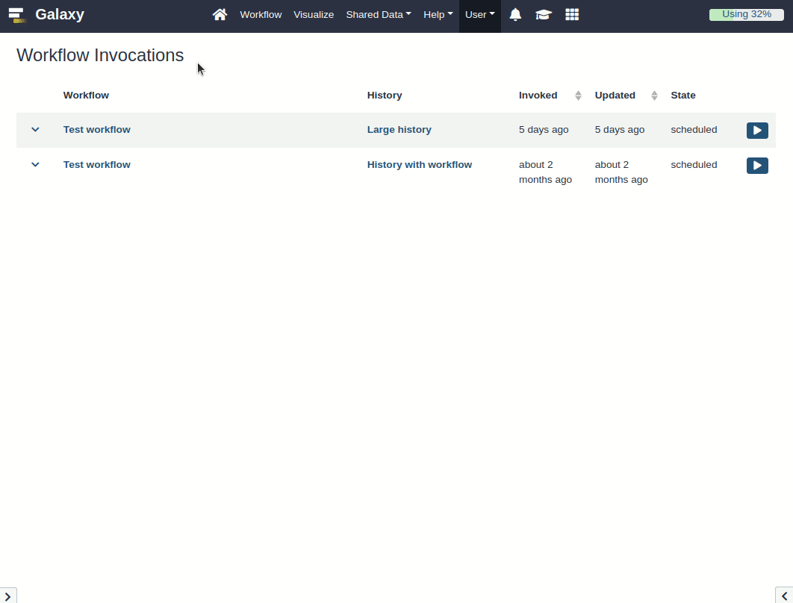
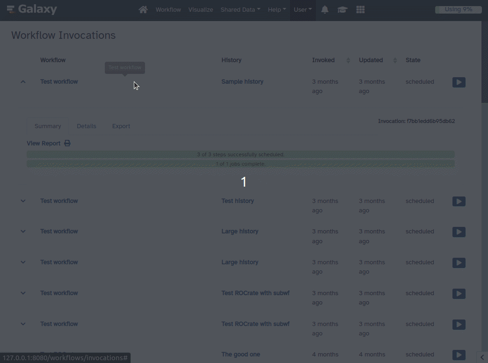

Galaxy has over the last month gained a powerful and extensible exporting framework.

Two export formats have alreaady been added to Galaxy:

* [BioComputeObjects](https://biocomputeobject.org/), a standard (IEEE 2791-2020) for tracking provenance information of bioinformatics pipelines for high-throughput sequencing.
* [RO-Crate](https://www.researchobject.org/ro-crate/), a FAIR archiving format of [Research Objects](https://www.researchobject.org/) based on [schema.org](https://schema.org/) and [Bioschemas](https://bioschemas.org/).

Every format can be downloaded directly, or written to pluggable Galaxy file sources (Dropbox, Google Drive, FTP, S3 ...). 

The feature described here will be part of the next Galaxy release, and should become available on `usegalaxy.eu` and related instances around March 2023 depending on the instance configuration.

## Export invocation to RO-Crate

In this example, a valid [RO-Crate](https://www.researchobject.org/ro-crate/) archive is exported from the workflow invocation view, capturing the complete Galaxy history:

The RO-Crate is following the [Workflow Run Crate profile](https://www.researchobject.org/workflow-run-crate/profiles/workflow_run_crate), embedding the input/output data frmo the workflow history, along with Galaxy log information and the executed Galaxy workflow definitions in several formats: Classical `*.ga` and newer [gxformat2](https://gxformat2.readthedocs.io/en/latest/readme.html#gxformat2) `*.gxwf.yml`, as well as an _Abstract CWL_ representing using the [Common Workflow Language](https://www.commonwl.org/) standard.

The RO-Crate can be explored and extended programmatically using the [Python RO-Crate library](https://pypi.org/project/rocrate/).

The [GTN Smörgåsbord 2023](https://gallantries.github.io/video-library/events/smorgasbord3/) will include a training module on [RO-Crate and Galaxy](https://gallantries.github.io/video-library/modules/ro-crate) that will expand on this approach.

## Export invocation to BioCompute Object

The previous support for exporting [BioCompute Objects](https://biocomputeobject.org/) (BCO) have been integrated into the new exporting framework.  In addition to the direct download of an BCO or storing it in an external source, this export plugin also allows sending a BCO to an external database:

Note that the BCO is a JSON file with provenance metadata, which includes data references as URLs to the Galaxy history. Therefore, it's recommended to make the history public, in order for workflow data to be accessible. Future work will explore combining BCO export within an RO-Crate archive following the [BCO RO-Crate profile](https://biocompute-objects.github.io/bco-ro-crate/), with further archiving in external repositories like Zenodo and WorkflowHub.

## How to add new export plugins

If you would like to export workflow invocations, histories or history elements, 
you can now extend the backend in a well defined way to create your preferred format. 
The same holds true for the frontend, where you have an easy way of defining new export formats from which a user can choose.

Adding new export plugins is relatively easy. Once the backend supports a new export format, we can add a new `InvocationExportPlugin` instance inside
`client/src/components/Workflow/Invocation/Export/Plugins/` and register it in the *index.js* file. That's it!

Each export plugin can define additional custom operations, for example to collect addional metadata from the user before the export starts.

If the plugin needs to display additional components as part of the custom actions, for example for additional metadata,
it should be done inside a modal like in the example above, and the additional component should be placed in a subfolder with the name of the plugin.

This work is based on previous work from [John Chilton](https://github.com/jmchilton), who added a backend component and APIs for serving files.
Thanks to [David](https://github.com/davelopez), [Paul](https://github.com/pauldg), [Hadley](https://github.com/HadleyKing), and [Stian](https://github.com/stian) for working on this project.
