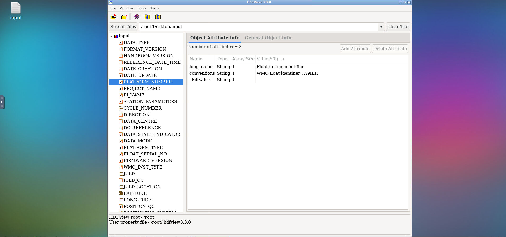

Fair-Ease project aims at providing users with an easy and FAIR tool for discovery and access to environmental multidisciplinary and aggregated data-sets, as well as set up a virtual research environment (EAL - Earth Analytical Lab) through web-based interfaces.

EuroScienceGateway leverage a distributed computing network and user-friendly web portal, facilitating access to compute and storage infrastructures across Europe as well as to data, tools, workflows and services that can be customised to suit researchers’ needs.

Thus, the collaboration of those two EOSC projects will allow the creation of cross-discipline workflows between climate science, biodiversity studies and the earth sciences, creating, sharing and re-using tools and workflows in Galaxy.

# The 2-days training session

With the strong support and help of Björn Grüning and Tunc Tkayikci we conducted a Galaxy discovery of 2 days in Lille.

The first day aimed at providing training on how to use the Galaxy platform. In order to do so our guiding thread was the climate related tutorials
from the GTN written by Anne Fouilloux ([Pangeo Notebook in Galaxy](https://training.galaxyproject.org/training-material/topics/climate/tutorials/pangeo-notebook/tutorial.html), [Pangeo ecosystem 101 for everyone](https://training.galaxyproject.org/training-material/topics/climate/tutorials/pangeo/tutorial.html)
and [Visualize Climate data with Panoply netCDF viewer](https://training.galaxyproject.org/training-material/topics/climate/tutorials/panoply/tutorial.html))
after a bief introduction from the Galaxy for Ecology initiative. 
We finished the day by a quick explanation on how to develop and integrate tools for Galaxy with the installation of a local Galaxy test instance.

The second day was conducted as a workshop where everybody could work on the tools they wanted to integrate in Galaxy,
could ask questions, and ask for help to the 3 trainers (Björn, Tunc and myself Marie).
During this day we were able to get 3 tools integrated in Galaxy and deployed in the European Galaxy server. One day them up and running in production and usable by
everyone! blush

## DIVAnd Interactive Galaxy Tool

Notebooks in this Jupyter Lab environment allows to explore programmatic access to [DIVAnd's](https://github.com/gher-uliege/DIVAnd.jl) (Data-Interpolating Variational Analysis in n dimensions) package. Try it out! [![European Galaxy server](https://img.shields.io/badge/usegalaxy-.eu-brightgreen?logo=)](https://usegalaxy.eu/root?tool_id=interactive_tool_divand)

## Interactive HDF/NetCDF viewer using HDFView

[HDFView](https://earth.esa.int/eogateway/tools/hdfview) is a Desktop application to display netcdf, hdf4 or hdf5 files.
Part of this work is a [new datatype that was added to Galaxy](https://github.com/galaxyproject/galaxy/pull/16105) by [Théo Mathurin](https://github.com/TheoMathurin).

Try it out! [![European Galaxy server](https://img.shields.io/badge/usegalaxy-.eu-brightgreen?logo=)](https://usegalaxy.eu/root?tool_id=interactive_tool_hdfview)

## Scoop3-Argo as Interactive Galaxy tool

Interactive visual quality control of Argo netCDF files.

Try it out! [![European Galaxy server](https://img.shields.io/badge/usegalaxy-.eu-brightgreen?logo=)](https://usegalaxy.eu/root?tool_id=interactive_tool_scoop3_argo)

)

# Conclusion

This training allowed the Fair-Ease partners to get the basis about Galaxy and on how to use the platform and how to integrate tools into Galaxy.
It was pretty efficient as we succeeded, with the attendants, to get many tools ready and 3 tools even deploved in production on the European Galaxy server.
We hope to continue this collaboration and go on contributing to the Galaxy ecosystem.

