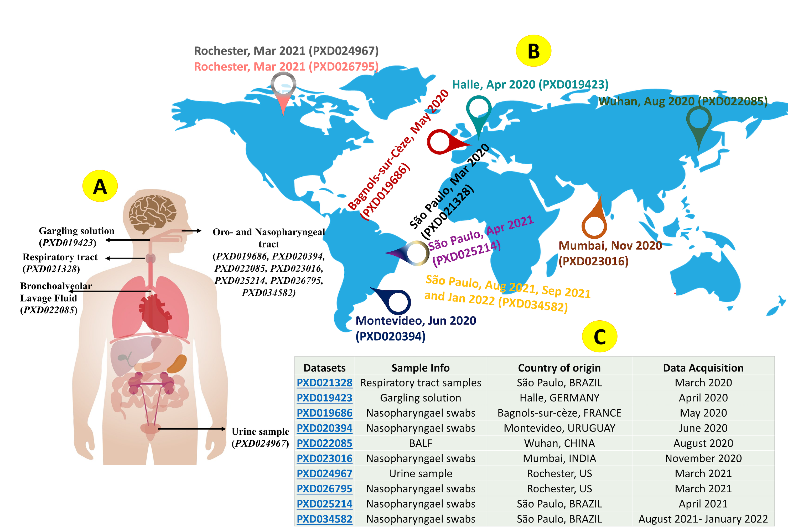
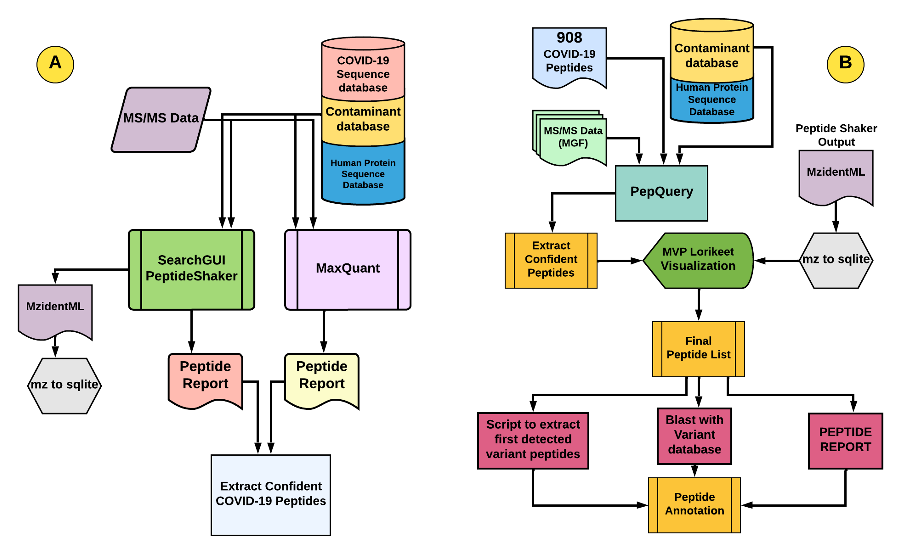
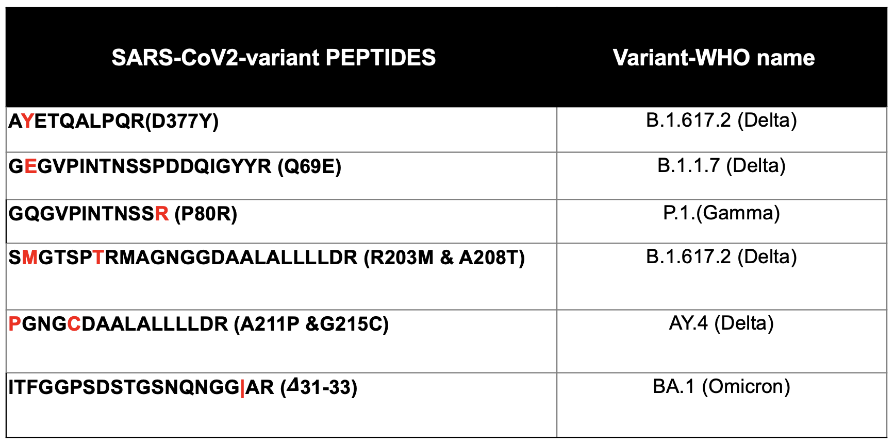

# Variant specific peptide panel for diagnosis, characterization and surveillance of the SARS-CoV2 variants during the pandemic. 

## Live Resources

| Input / History / Workflow  | Link                                                        |
|--------------------------|-------------------------------------------------------------|
| Input data               | [https://usegalaxy.eu/u/subina/h/covid-paper-workflow-input](https://usegalaxy.eu/u/galaxyp/h/covid-viruses-input)  |
| Variant analysis history | [https://usegalaxy.eu/u/galaxyp/h/covid-viruses-history](https://usegalaxy.eu/u/galaxyp/h/covid-viruses-history) |
| Discovery workflow       | [https://usegalaxy.eu/u/subina/w/covid-discovery-workflow](https://usegalaxy.eu/u/galaxyp/w/coviddiscovery-workflow)    |
| Verification workflow    | [https://usegalaxy.eu/u/subina/w/covid-verification-workflow](https://usegalaxy.eu/u/galaxyp/w/covid-verification-workflow) |

## Description

The COVID-19 pandemic continues with the emergence of new strains. As virulence seems to be increasing with each variant, there is a dire need to advance the MS-based diagnostics to identify optimal strain-specific biomarker peptides from non-invasively collected clinical samples.The [Galaxy-P Team](http://galaxyp.org/) has developed workflows to detect and validate the SARS-CoV-2 peptides useful for developing targeted MS-based biomarker assays.

## Workflows

Our workflows are divided into two parts:

A) **Discovery workflow**, where MS/MS data from publicly available & nasopharyngeal patient samples were searched against protein FASTA files from SARS-CoV-2 Wildtype (WT) & variant strains along with Human UniProt & contaminants using SearchGUI/Peptide Shaker & MaxQuant search algorithms. Confident peptides were extracted from the peptide results & SARS-CoV-2 peptides were filtered by removing human proteins & contaminants.
We detected 210 SARS-CoV-2 peptides from twelve clinical datasets. These peptides were then added to a panel of 803 peptides to get 908 unique peptides.
 
 
B) Verification workflow: In the second workflow, the 908 peptides were verified for their presence in the 12 clinical datasets using PepQuery Tool.The PepQuery Tool ranks the matches of the peptide panel to COVID-19 MS data against a reference proteome 
containing proteins from human and contaminants.Resulting data was filtered to generate a list of confident peptide matches with associated P-values (<0.05) to SARS-CoV-2 and its variants.
The peptide list was further analyzed using bioinformatic tool such as BLAST-P. The spectral quality of these verified peptides was inspected manually using Lorikeet tool within the Multi-omics Viewing Platform (MVP). 
Verified peptides were further investigated to extract additional information using the GSAID repository and then the peptides were manually aligned to the SARS-SoV2- Wild type sequence for variant identification.

## Results

Most of the verified strain-specific peptides, align to the nucleocapsid, and spike proteins of the viral proteome and would serve as the optimal targets for direct detection of SARS-CoV-2 strains.
The flexibility of the Galaxy workflows has the potential to detect the emerging strains on newly published MS datasets (DDA or parallel-reaction-monitoring (PRM)).  We are expanding our peptide panel to 
include peptide targets to detect emerging strains.

Here is a table of the different variants obtained from our workflows.

