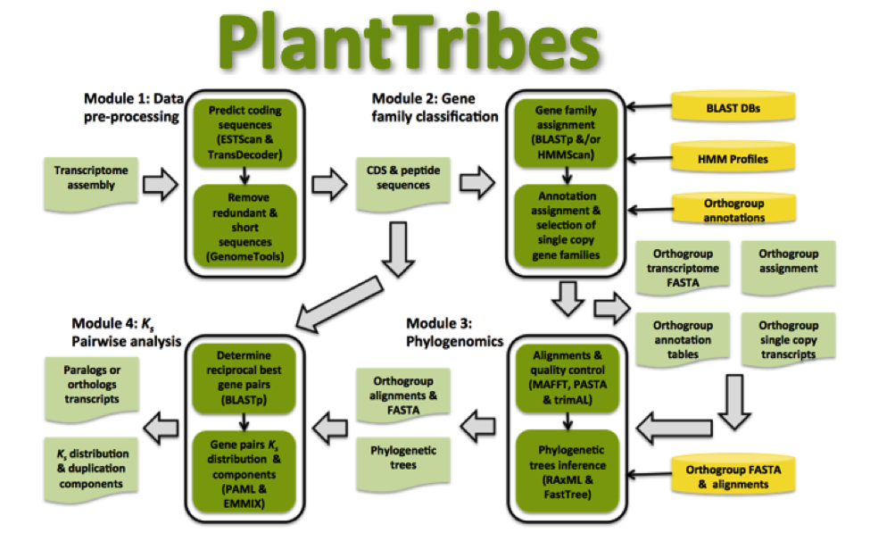
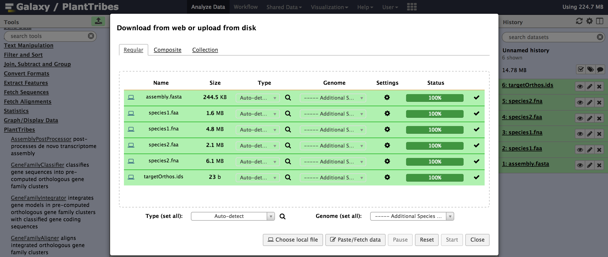
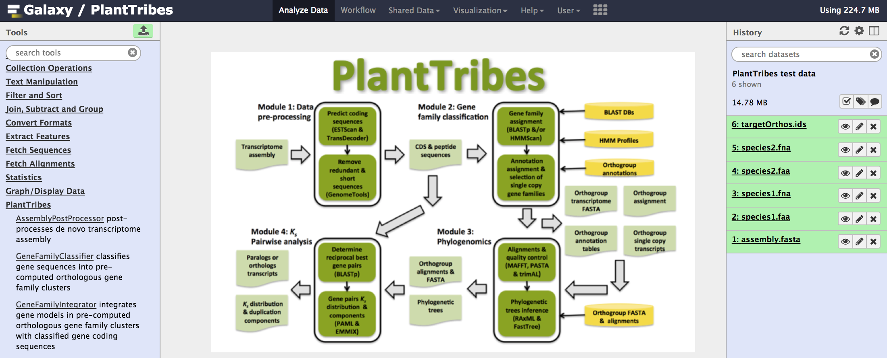
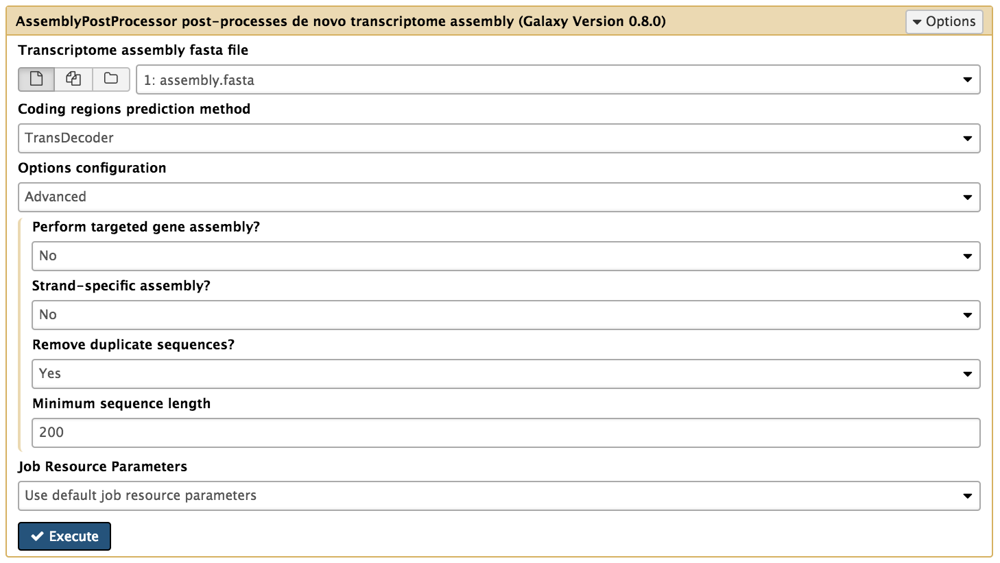
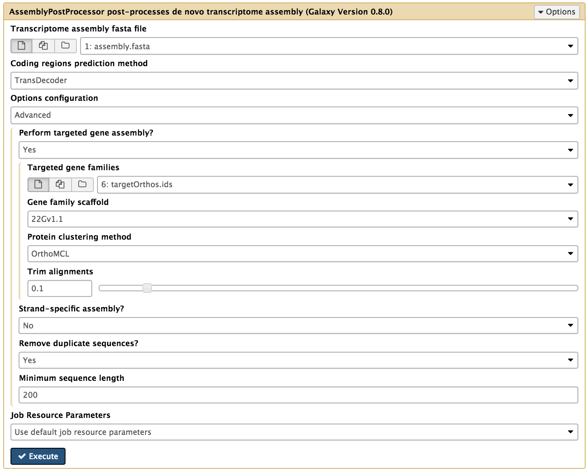
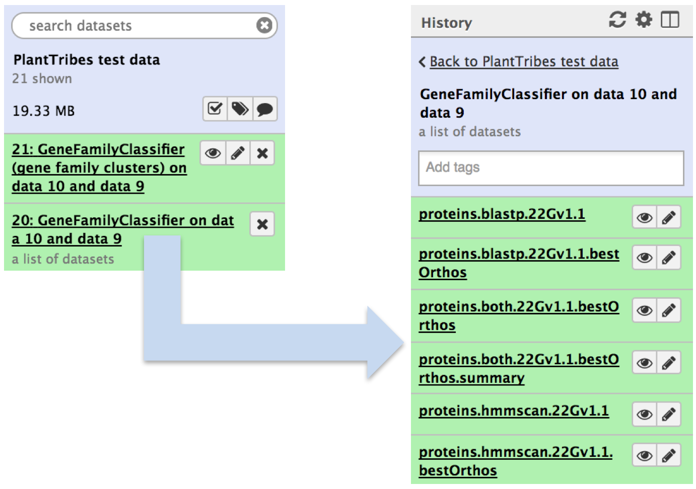
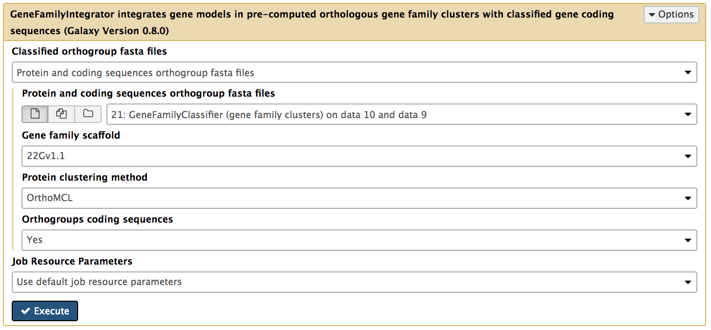
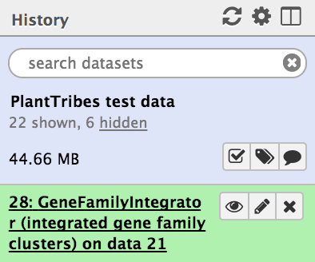
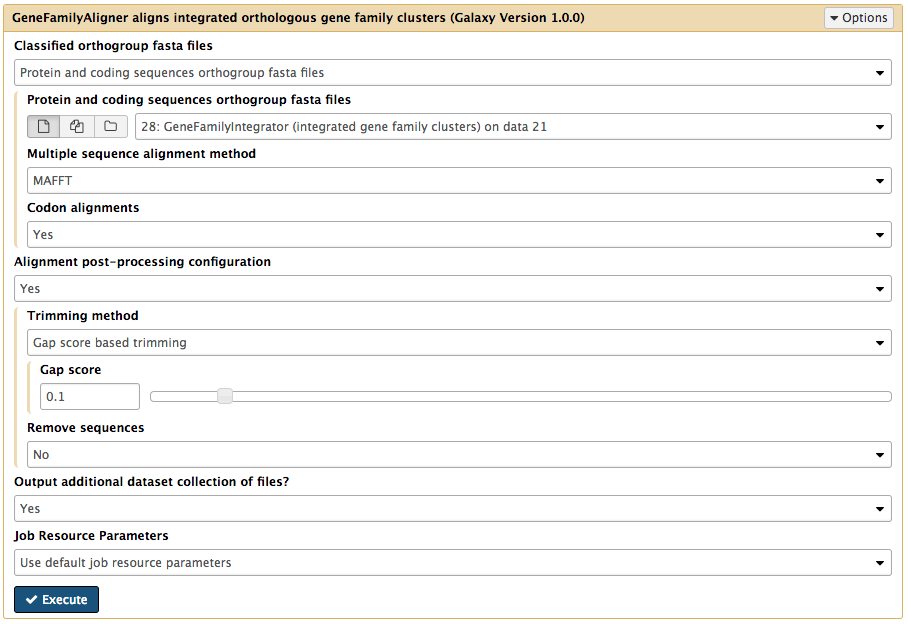

# **PlantTribes Analysis**

Here we show the basic steps of performing comparative and evolutionary analyses of gene families and transcriptomes using the Galaxy PlantTribes tools.  Specifically, we will

<ul>
    <li>determine the evolutionary relationship of de novo reconstructed transcripts across lineages in a gene family context</li>
    <li>determine whole genome duplication (WGD) events within a single species (paralogs comparison)</li>
</ul>

|      |
|------|
||
|<small>Figure 1. The `PlantTribes` analysis workflow</small>

<i class="fa fa-exclamation-circle" aria-hidden="true"></i> Note: we assume that the person reading this tutorial

    <ul>
        <li>has a basic understanding of how Galaxy works ([see this](/tutorials/g101) if you don't)</li>
        <li>has an account in Galaxy ([see this](/tutorials/g101/#setting-up-galaxy-account) if you don't)</li>
        <li>has their browser configured as described [here](/tutorials/g101/#getting-your-display-sorted-out)</li>
        <li>knows how to upload data into Galaxy ([see this](/tutorials/upload) if you don't)</li>
        <li>has a basic understanding of dataset collections ([see this](/tutorials/collections) if you don't)</li>
    </ul>

## **Topic points**

<ul>
    <li>Upload the PlantTribes test data for this tutorial into Galaxy</li>
    <li>Post-process transcripts derived from a de novo transcriptome assembly</li>
    <li>Target gene family assembly of post-processed transcripts derived from a de novo transcriptome assembly</li>
    <li>Classify post-processed transcripts into pre-computed orthologous gene family clusters</li>
    <li>Integrate gene models in pre-computed orthologous gene family clusters with classified transcripts</li>
    <li>Estimate multiple sequence alignments of integrated orthologous gene family clusters</li>
    <li>Build and visualize phylogenetic trees of aligned orthologous gene family clusters</li>
    <li>Estimate paralogous and orthologous pairwise non-synonymous (Ka) and synonymous (Ks) substitution rates and visualize the distribution with fitted significant components</li>
</ul>

## **Details about the test data**

In this tutorial, we will be using the test data available on the [PlantTribes GitHub repository](https://github.com/dePamphilis/PlantTribes/tree/master/test).

| Dataset            | Description                                                                                                                                                              |
|--------------------|--------------------------------------------------------------------------------------------------------------------------------------------------------------------------|
| `assembly.fasta`   | A sub-set of a plant transcriptome de novo assembly                                                                                                                      |
| `targetOrthos.ids` | A list of targeted orthogroup identifiers corresponding to the 22 representative plant genomes gene family scaffold                                                      |
| `species1.fna`     | A sub-set of coding sequences (CDS) for the first species for estimating paralogous and orthologous pairwise synonymous (Ks) and non-synonymous (Ka) substitution rates  |
| `species1.faa`     | Corresponding protein sequences for the first species for estimating paralogous and orthologous pairwise synonymous (Ks) and non-synonymous (Ka) substitution rates      |
| `species2.fna`     | A sub-set of coding sequences (CDS) for the second species for estimating paralogous and orthologous pairwise synonymous (Ks) and non-synonymous (Ka) substitution rates |
| `species2.faa`     | Corresponding protein sequences for the second species for estimating paralogous and orthologous pairwise synonymous (Ks) and non-synonymous (Ka) substitution rates     |

**Note**: Some screenshots shown here may appear slightly different from the ones you will see on your screen. Galaxy is quickly evolving and as a result some discrepancies are possible.

## **Getting started**

Upload into Galaxy the test datasets that you downloaded from the [PlantTribes GitHub repository](https://github.com/dePamphilis/PlantTribes/tree/master/test).  You can use the upload tool's `Auto-detect` feature or manually set the data formats.  If you use `Auto-detect`, make sure that the data formats are properly set for all files.  With the exception of `targetOrthos.ids` which is `tabular`, data formats are all `fasta`.

|      |
|------|
||
|<small>Figure 2. Uploading the test datasets from the PlantTribes GitHub repository into Galaxy</small>

Uploading the datasets into Galaxy creates a new history.  You can rename the history to be `PlantTribes test data` by clicking on `Unnamed history`.

|      |
|------|
||
|<small>Figure 3. A new history named `PlantTribes test data`</small>

## **Post-process transcripts derived from a de novo transcriptome assembly (basic run)**

Open the `PlantTribes` section in your tool panel and select the `AssemblyPostprocessor` tool.  Select the following settings on the tool form to post-process the de novo assembly test dataset `assembly.fasta` (history item 1) using `TransDecoder` coding regions prediction method.  The `Remove duplicate sequences` option will remove similar (sub)sequences and sequences shorter than 200 bp.

|      |
|------|
||
|<small>Figure 4. `AssemblyPostProcessor` options (basic run)</small>

Executing the `AssemblyPostProcessor` tool with the settings shown in `Figure 4` will produce the following items in your history.

|      |
|------|
||
|<small>Figure 5. `AssemblyPostProcessor` outputs (basic run)</small>

### Description of the outputs (basic run)

<ul>
    <li>Primary TransDecoder coding regions prediction `transcripts.pep` and `transcripts.cds` (history items 7 and 12)</li>
    <li>Validated and filtered representative coding region predictions `transcripts.cleaned.pep` and `transcripts.cleaned.cds` (history items 8 and 11)</li>
    <li>Validated, filtered and non-redundant representative coding region predictions `transcripts.cleaned.nr.pep` and `transcripts.cleaned.nr.cds` (history items 9 and 10)</li>
</ul>

## **Target gene family assembly of post-processed transcripts derived from a de novo transcriptome assembly**

Using the `AssemblyPostProcessor` tool again, enter the following settings to:

<ul>
    <li>assign post-processed transcripts of `assembly.fasta` (history item 1) to targeted gene families (orthogroups) listed in the `targetOrthos.ids` (history item 6) of the `22Gv1.1 OrthoMCL scaffold`</li>
    <li>whenever possible, reassemble fragmented primary contigs with sufficiently overlapping ends</li>
</ul>

|      |
|------|
||
|<small>Figure 6. `AssemblyPostProcessor` options (advanced run)</small>

Executing the `AssemblyPostProcessor` tool with the settings shown in `Figure 6` will produce the following items in your history.

|      |
|------|
||
|<small>Figure 7. `AssemblyPostProcessor` outputs (advanced run)</small>

### Description of the outputs (advanced run)

<ul>
    <li>Primary `TransDecoder` coding regions prediction `transcripts.pep` and `transcripts.cds` (history items 14 and 19)</li>
    <li>Validated and filtered representative coding region predictions `transcripts.cleaned.pep` and `transcripts.cleaned.cds` (history items 15 and 18)</li>
    <li>Validated, filtered and non-redundant representative coding region predictions `transcripts.cleaned.nr.pep` and `transcripts.cleaned.nr.cds` (history items 16 and 17)</li>
    <li>A collection of sub-directories of post-processed targeted gene family assemblies (history item 13), each of which contains:
        <ul>
            <li>targeted gene family primary assembly (`*.contigs.fasta`)</li>
            <li>corresponding non-redundant representative coding region predictions (`*.contigs.fasta.cds`)</li>
            <li>corresponding non-redundant representative protein predictions (`*.contigs.fasta.pep`)</li>
            <li>targeted gene family primary assembly summary statistics (`*.contigs.fasta.stats`)</li>
        </ul>
    </li>
</ul>

## **Classify post-processed transcripts into pre-computed orthologous gene family clusters**

Select the `GeneFamilyClassifier` tool from the `PlantTribes` section in your tool panel and enter the following settings on the tool form to classify post-processed transcripts `transcripts.cleaned.nr.pep` and `transcripts.cleaned.nr.cds` (history items 9 and 10) using both `blastp` and `hmmscan` into pre-computed orthogroups of the `22Gv1.1 OrthoMCL scaffold` and to create protein and coding sequences orthogroup fasta files for the classified transcripts.

|      |
|------|
||
|<small>Figure 8. `GeneFamilyClassifier` settings</small>

Executing the `GeneFamilyClassifier` tool with the settings shown in `Figure 8` will produce the following items in your history.

|      |
|------|
||
|<small>Figure 9. `GeneFamilyClassifier` outputs which include a dataset collection (history item 20)</small>

### Description of the outputs

<ul>
    <li>Gene family classification protein and coding sequences orthogroup fasta files `gene family clusters` (history item 21)</li>
    <li>Gene family classification metadata files contained within a dataset collection (history item 20) which consists of
        <ul>
            <li>`proteins.blastp.22Gv1.1` - `blastp` results of predicted peptides `transcripts.cleaned.nr.pep` (history item 9) against `22Gv1.1 OrthoMCL scaffold` protein blast database</li>
            <li>`proteins.hmmscan.22Gv1.1` - `hmmscan` results of predicted peptides `transcripts.cleaned.nr.pep` (history item 9) against `22Gv1.1 OrthoMCL scaffold` protein orthogoup HMM profiles</li>
            <li>`proteins.blastp.22Gv1.1.bestOrthos` - best scoring `22Gv1.1 OrthoMCL scaffold` orthogroups for predicted peptides `transcripts.cleaned.nr.pep` (history item 9) based on `blastp` results</li>
            <li>`proteins.hmmscan.22Gv1.1.bestOrthos` - best scoring `22Gv1.1 OrthoMCL scaffold` orthogroups for predicted peptides `transcripts.cleaned.nr.pep` (history item 9) based on `hmmscan` results</li>
            <li>`proteins.both.22Gv1.1.bestOrthos` - selected best scoring `22Gv1.1 OrthoMCL scaffold` orthogroups for predicted peptides `transcripts.cleaned.nr.pep` (history item 9) based on both `blastp` and `hmmscan` results</li>
            <li>`proteins.both.22Gv1.1.bestOrthos.summary` - annotation summary of assigned orthogroups that includes gene counts of scaffold backbone taxa, super clusters (super orthogoups) at multiple stringencies and functional annotations from sources such as Gene Ontology (GO), InterPro protein domains, TAIR, UniProtKB/TrEMBL and UniProtKB/Swiss-Prot</li>
        </ul>
    </li>
</ul>

## **Integrate gene models in pre-computed orthologous gene family clusters with classified transcripts**

Select the `GeneFamilyIntegrator` tool from the `PlantTribes` section in your tool panel and enter the following settings on the tool form to integrate `22Gv1.1 OrthoMCL scaffold` orthogroup backbone gene models with classified protein and coding sequences orthogroup fasta files (history item 21).

|      |
|------|
||
|<small>Figure 10. `GeneFamilyIntegrator` settings</small>

Executing the `GeneFamilyIntegrator` tool with the settings shown in `Figure 10` will produce the following item in your history.

|      |
|------|
||
|<small>Figure 11. `GeneFamilyIntegrator` output</small>

### Description of the outputs

<ul>
    <li>Integrated gene family classification protein and coding sequences orthogroup fasta files (history item 28)</li>
</ul>

## **Estimate multiple sequence alignments of integrated orthologous gene family clusters**

Select the `GeneFamilyAligner` tool from the `PlantTribes` section in your tool panel and enter the following settings on the tool form to align integrated protein and coding sequences orthogroup fasta files (history item 28) using the `MAFFT` multiple sequence alignment method.

|      |
|------|
||
|<small>Figure 12. `GeneFamilyAligner` settings</small>

Executing the `GeneFamilyAligner` tool with the `Output additional dataset collection of files` option set to "Yes" (in addition to the settings shown in Figure 12) will produce an additional dataset collection item in your history. The elements of this dataset collection are orthogroup multiple sequence alignment files in fasta format. You can render graphic visualizations of these files by clicking on the visualization icon in the history item. You can render the visualization using the `MSA viewer` to visualize large MSAs interactively or you can launch Jalview (a JNLP based multiple sequence alignment editing, visualization, and analysis workbench) to perform additional tasks on the multiple sequence alignment.

|      |
|------|
||
|<small>Figure 13. `GeneFamilyAligner` output</small>

### Description of the outputs

<ul>
    <li>Trimmed gene family classification protein and coding sequences orthogroup multiple sequence alignments fasta files (history item 29)</li>
    <li>A dataset collection of trimmed gene family classification protein and coding sequences orthogroup multiple sequence alignments fasta files (history item 29)</li>
</ul>

## **Build and visualize phylogenetic trees of aligned orthologous gene family clusters**

Select the `GeneFamilyPhylogenyBuilder` tool from the `PlantTribes` section in your tool panel and enter the following settings on the tool form to build phylogenetic trees of trimmed protein and coding sequences multiple sequence alignments (history item 29) using the `FastTree` phylogenetic inference method.

|      |
|------|
||
|<small>Figure 14. `GeneFamilyPhylogenyBuilder` settings</small>

Executing the `GeneFamilyPhylogenyBuilder` tool with the settings shown in `Figure 14` will produce multiple items in your history, including the following dataset collection.  The elements of this dataset collection are orthogroup newick phylogenetic tree files, all having the `nhx` Galaxy datatype.  You can render graphic visualizations of these files by clicking on the `Visualize` icon for the history item which will allow you to choose to render the visualization using either the `Charts` plugin or the `Phyloviz` plugin.  The graphic to the left of the bottom arrow in `Figure 15` is produced when choosing the `Phyloviz` plugin.

|      |
|------|
||
|<small>Figure 15. `GeneFamilyPhylogenyBuilder` dataset collection output</small>

### Description of the outputs

<ul>
    <li>A dataset collection of gene family orthogroup newick phylogenetic tree files (history item 30)</li>
</ul>

## **Build and visualize phylogenetic trees of aligned orthologous gene family clusters**

Select the `GeneFamilyPhylogenyBuilder` tool from the `PlantTribes` section in your tool panel and enter the following settings on the tool form to build phylogenetic trees of trimmed protein and coding sequences multiple sequence alignments (history item 29) using the `FastTree` phylogenetic inference method.

|      |
|------|
||
|<small>Figure 14. `GeneFamilyPhylogenyBuilder` settings</small>

Executing the `GeneFamilyPhylogenyBuilder` tool with the settings shown in `Figure 14` will produce multiple items in your history, including the following dataset collection.  The elements of this dataset collection are orthogroup newick phylogenetic tree files, all having the `nhx` Galaxy datatype.  You can render graphic visualizations of these files by clicking on the `Visualize` icon for the history item which will allow you to choose to render the visualization using either the `Charts` plugin or the `Phyloviz` plugin.  The graphic to the left of the bottom arrow in `Figure 15` is produced when choosing the `Phyloviz` plugin.

|      |
|------|
||
|<small>Figure 15. `GeneFamilyPhylogenyBuilder` dataset collection output</small>

The `Charts` plugin provides several options for rendering the visualization.

|      |
|------|
||
|<small>Figure 16. Charts visualization of one of the dataset collection elements produced by the `GeneFamilyPhylogenyBuilder` tool</small>

## **Estimate paralogous and orthologous pairwise non-synonymous (Ka) and synonymous (Ks) substitution rates and visualize the distribution with fitted significant components**

Select the `KaKsAnalysis` tool from the `PlantTribes` section in your tool panel and enter the following settings on the tool form to estimate paralogous pairwise synonymous (Ks) substitution rates and significant distribution Ks components and plot the distribution with fitted significant components.

|      |
|------|
||
|<small>Figure 17. `KaKsAnalysis` settings</small>

Executing the `KaKsAnalysis` tool with the settings shown in `Figure 17` will produce the items shown on the left side of `Figure 18` in your history.

|      |
|------|
||
|<small>Figure 18. `KaKsAnalysis` outputs and process flow to visualize the distribution with fitted significant components</small>

### Description of the outputs (left side of `Figure 18`)

<ul>
    <li>Reformatted species1 input coding sequences (history item 187)</li>
    <li>Reformatted species1 input amino acids (history item 188)</li>
    <li>Species1 self blastn results (history item 189)</li>
    <li>Species1 paralogous pairs (history item 190)</li>
    <li>Species1 non-synonymous (Ka) and synonymous (Ks) substitution rates analysis results (history item 191)</li>
    <li>Estimated significant components in the distribution of species1 synonymous (Ks) substitution rates (history item 192)</li>
</ul>

### Visualize the distribution with fitted significant components (process flow depicted in `Figure 18`)

Select the `KsDistribution` tool from the `PlantTribes` section in your tool panel and select history items 191 and 192 for the inputs as shown in the upper right image in `Figure 18`.  Executing the tool will produce a history item with a `pdf` data format (lower right corner of `Figure 18`) which is the species1 synonymous (Ks) substitution distribution plot (history item 193).  When the `View data` icon for the history item is clicked, the dataset is rendered (lower middle of `Figure 18`).

## **That's it!**

Hopefully this tutorial has given you a taste for what is possible with these `PlantTribes` tools. Experiment!  There are many more things that you can do with them.  If things do not work - complain using the `Open Chat` button below or the [Galaxy support forum](https://help.galaxyproject.org/).
The `Charts` plugin provides several options for rendering the visualization.

|      |
|------|
||
|<small>Figure 16. Charts visualization of one of the dataset collection elements produced by the `GeneFamilyPhylogenyBuilder` tool</small>

## **Estimate paralogous and orthologous pairwise non-synonymous (Ka) and synonymous (Ks) substitution rates and visualize the distribution with fitted significant components**

Select the `KaKsAnalysis` tool from the `PlantTribes` section in your tool panel and enter the following settings on the tool form to estimate paralogous pairwise synonymous (Ks) substitution rates and significant distribution Ks components and plot the distribution with fitted significant components.

|      |
|------|
||
|<small>Figure 17. `KaKsAnalysis` settings</small>

Executing the `KaKsAnalysis` tool with the settings shown in `Figure 17` will produce the items shown on the left side of `Figure 18` in your history.

|      |
|------|
||
|<small>Figure 18. `KaKsAnalysis` outputs and process flow to visualize the distribution with fitted significant components</small>

### Description of the outputs (left side of `Figure 18`)

<ul>
    <li>Reformatted species1 input coding sequences (history item 187)</li>
    <li>Reformatted species1 input amino acids (history item 188)</li>
    <li>Species1 self blastn results (history item 189)</li>
    <li>Species1 paralogous pairs (history item 190)</li>
    <li>Species1 non-synonymous (Ka) and synonymous (Ks) substitution rates analysis results (history item 191)</li>
    <li>Estimated significant components in the distribution of species1 synonymous (Ks) substitution rates (history item 192)</li>
</ul>

### Visualize the distribution with fitted significant components (process flow depicted in `Figure 18`)

Select the `KsDistribution` tool from the `PlantTribes` section in your tool panel and select history items 191 and 192 for the inputs as shown in the upper right image in `Figure 18`.  Executing the tool will produce a history item with a `pdf` data format (lower right corner of `Figure 18`) which is the species1 synonymous (Ks) substitution distribution plot (history item 193).  When the `View data` icon for the history item is clicked, the dataset is rendered (lower middle of `Figure 18`).

## **That's it!**

Hopefully this tutorial has given you a taste for what is possible with these `PlantTribes` tools. Experiment!  There are many more things that you can do with them.  If things do not work - complain using the `Open Chat` button below or the [Galaxy support forum](https://help.galaxyproject.org/).
